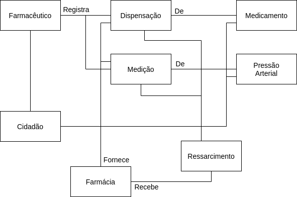
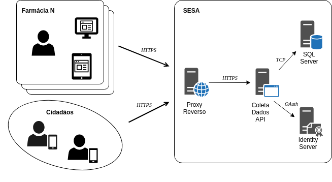
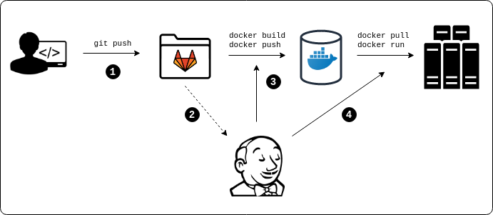
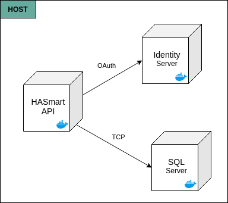

# Módulo de Coleta de Dados HASmart

## Descrição
O projeto HASmart é uma iniciativa conjunta entre a Diretoria de Pesquisa, Desenvolvimento 
e Inovação da Universidade de Fortaleza 
([DPDI](https://www.unifor.br/web/pesquisa-inovacao)) e a Secretaria de Saúde do Ceará 
([SESA](https://www.saude.ce.gov.br/)) na investigação e controle de dados de hipertensão 
arterial da população do estado.

O módulo de  Coleta Dados HASmart tem por objetivo automatizar as ações necessárias de coleta de informações dos 
pacientes no que se refere a pressão arterial e uso de medicamentos no programa HASmart. Esse repositório contém
o código-fonte da API Web que implementa o _backend_ do módulo de coleta.

## Visão Geral
A coleta de dados para o programa HASmart acontece em torno do fluxo de trabalho diário das farmácias durante o 
atendimento de pessoas enquadradas no programa. O objetivo é coletar informações sensíveis como a pressão arterial,
dados pessoais e medicamentos que são usados pela população.

Em um fluxo normal, o ```cidadão``` procura uma ```farmácia``` cadastrada no programa para utilizar um dos serviços 
disponíveis: ```medição``` da pressão arterial ou ```dispensação``` de medicamentos. O ```farmecêutico``` é a pessoa
responsável por realizar esse atendimento. Além da medição e medicamentos dispensados, o farmacêutico solicita ao 
cidadão seus ```dados pessoais``` e ```indicadores de risco``` de hipertensão. Esses dados serão utilizados para estudo
e avaliação da população em geral. Periodicamente, o ```ressarcimento``` dos serviços prestados pela farmácia é 
realizado, isto é, pelos medicamentos dispensados e medições realizadas.

A figura abaixo detalha esse modelo conceitual.



## Arquitetura
De uma maneira geral, podemos descrever a arquitetura da solução citando as decisões tomadas para os seguintes pontos de
atenção na aplicação de coleta de dados:

- **Interface:** A interface da aplicação é implementada na plataforma [Angular](https://angular.io/). 
O Angular é um framework de desenvolvimento orientado a componentes, aderente aos principais padrões de mercado para a 
plataforma Web (HTML, CSS, JavaScript, REST, JSON, etc);
- **Processamento e serialização de requisições:** Como consequência do uso da plataforma Web, as ações realizadas pelo 
usuário na aplicação são empacotadas e encaminhadas para o back-end da aplicação na forma de requisições HTTP. Os dados
trafegados são serializados no formato [JSON](https://www.json.org/);   
- **Back-end, organização Lógica e padrões:** O back-end é implementado na tecnologia 
[.NET Core](https://docs.microsoft.com/pt-br/dotnet/core/), exposto como uma API Web utilizando o estilo arquitetural
REST. Esse back-end está organizado segundo as diretrizes da 
[Arquitetura Limpa](https://docs.microsoft.com/pt-br/dotnet/architecture/modern-web-apps-azure/common-web-application-architectures#clean-architecture) e os principais conceitos de 
[DDD](https://en.wikipedia.org/wiki/Domain-driven_design);
- **Organização física e ferramentas:** O código-fonte está disposto em projetos .NET específicos segundo a organização
lógica da aplicação. Os projetos são: ```HASmart.Core```, ```HASmart.Infrastructure```, ```HASmart.WebAPI``` e 
```IndentityServer```. O projeto utiliza possui configurações específicas para o 
[Visual Studio Code](https://code.visualstudio.com/) e depende fortemente da sua extensão 
[Remote Development](https://code.visualstudio.com/docs/remote/remote-overview);
- **Segurança:** A aplicação utilizará o protocolo [OAuth2](https://oauth.net/2/), fluxo _Client Credentials_, para 
autenticação e autorização de clientes. Esse é o protocolo padrão de mercado para aplicações Web. O projeto fará uso do
Identity Server corporativo para registrar as configurações de recursos, clientes, etc;
- **Guarda de dados:** A aplicação utilizará o banco de dados 
[SQL Sever](https://www.microsoft.com/pt-br/sql-server/sql-server-2019);
- **Biometria:** _A SER ESCRITO_
- **Empacotamento e distribuição:** A aplicação será empacotada, distribuída e implantada em imagens 
[Docker](https://www.docker.com/) disponíveis em repositório privado da SESA.

As seções abaixo detalham os pontos de atenção e a arquitetura da aplicação de coleta de dados por diferentes 
perspectivas (lógica, física, etc).

### Tecnologias, Ferramentas e dependências
- .NET Core 3.1
- VSCode
    - Remote Development Extension
- Docker (Desktop e Compose)
- MS SQL
- Identity Server

### Organização do repositório
O repositório está organizado em projetos .NET Core (que contém o código-fonte da API) e pastas com
artefatos auxiliares. Associamos uma camada lógica da solução a cada projeto conforme a seguinte 
lista: 

- [HASmart.Core](HASmart.Core): Contém os elementos que coordenam e implementam as regras 
de negócio de medição da tensão arterial. Encontram-se nesse projeto: entidades, 
[agregadores](https://martinfowler.com/bliki/DDD_Aggregate.html), 
[repositórios](https://deviq.com/repository-pattern/),
[serviços de aplicação e domínio](https://enterprisecraftsmanship.com/posts/domain-vs-application-services/) e
[objetos de transferência de dados](https://pt.wikipedia.org/wiki/Objeto_de_Transfer%C3%AAncia_de_Dados);

- [HASmart.Infrastructure](HASmart.Infrastructure): Contém os artefatos necessários para acesso a dados, implementação
de repositórios e serviços comuns de infraestrutura (acesso a arquivos, geração de logs, etc);

- [HASmart.WebApi](HASmart.WebApi): Contém classes e outros artefatos reponsáveis pelo tratamento de requisições web e 
interação com quaisquer clientes HTTP (Controladores);

<!-- TODO  Detalhar para cada projeto: responsabilidades, composição, como criar novos artefatos... --> 

Há outros artefatos no repositório que auxiliam a montagem dos ambientes de 
execução da API (e.g. arquivos de configuração, scripts, etc). Esses artefatos encontram-se nas 
seguintes pastas:

- [.vscode](.vscode): Contém artefatos necessários ao Visual Studio Code para construção e 
distribuição da API em tempo de desenvolvimento;
- [.devcontainer](.devcontainer): Contém artefatos utilizados pela extensão de desenvolvimento 
remoto do VSCode. Nessa pasta, definimos o estado do container de desenvolvimento, isto é, quais 
aplicativos serão instalados, políticas de permissão de usuários, etc;
- [data](data): Contém arquivos de metadados e scripts SQL para criação de Bancos de Dados de 
desenvolvimento e testes;     
- [IdentityServer](IdentityServer): Projeto utilizado para especificar as regras e perfis de 
autenticação e autorização em tempo de desenvolvimento.

Por fim, na pasta raiz encontramos arquivos que definem o ambiente de homologação ou produtivo 
(arquivos *Dockerfile* e *docker-compose*) como também seus respectivos processos de construção 
(arquivo *[Jenkinsfile](Jenkinsfile)*).

### Solução física


Na figura acima temos o desenho geral dos componentes físicos da solução e de como eles interagem.
As aplicações de front-end (ex., coleta-dados-ui) estarão disponíveis em um servidor web na rede 
interna da Sesa e, após acessadas, executarão em browsers ou dispositivos móveis no lado cliente.
O front-end se comunica com o back-end \ API por meio de HTTPS. O acesso ao back-end será 
intermediado por um proxy reverso \ gateway que já faz parte da infraestrutura da secretaria.

O back-end será exposto como uma API REST acessível por meio do protocolo HTTPS. Os controles de 
autenticação e autorização serão fornecidos pela interação entre o _framework_ .NET Core e provedor
_OAuth_ (no caso da solução um Identity Server corporativo). Os dados da aplicação serão armazenados
no servidor SQL Server disponível.

### Implantação
O processo de desenvolvimento e implantação do módulo de coleta de dados é baseado em _containers_ e
na tecnologia Docker. Utilizamos essa tecnologia para facilitar o processo de construção, 
empacotamento e também reduzir o número de discrepâncias entre os diversos 
perímetros de implantação (DEV, HOMOLOGAÇÃO, PRODUÇÃO, etc.). 

O esboço abaixo descreve um processo de implantação genérico. Após uma nova mudança no repositório 
(1), o orquestrador do processo de integração contínua recebe uma notificação (2) e aciona a 
construção e atualização da imagem docker da aplicação no repositório privado (3). Por fim, o 
orquestrador atualiza as instâncias da imagem em execução (os _containers_ docker) como também as 
configurações necessárias no perímetro de implantação (4).  



Para que o processo  de implantação ocorra a contento, ele deve considerar:

+ O domínio, a configuração do protocolo HTTPS e seus certificados;
+ A disponibilização de acesso a API para o público externo por meio de configuração no proxy 
reverso;
+ A configuração de _realms_, usuários e perfis de acesso no provedor OAuth;
+ A criação, configuração e carga inicial do banco de dados da aplicação.

#### DEV


Em ambiente de desenvolvimento, não utilizaremos um proxy reverso. Sendo assim, não será necessário 
configurar um domínio específico e regras de roteamento no servidor web do proxy. Os outros pontos
da implantação ficam da seguinte forma:

+ Cada elemento físico da solução será implantado como um container docker;
+ O certificado para configuração do protocolo HTTPS serão gerados localmente por uma ferramenta
do .NET Core;
+ A configuração do Identity Server, usuários e perfis é feita no próprio projeto do Identity Server
que foi criado para simular um servidor OAuth corporativo;
+ As atividades de criação, configuração e carga inicial do BD serão feitas durante a execução do 
container do BD por meio de um script de inicialização disponível na pasta [data](data). 

#### PRODUÇÃO

_A Ser Definido_

